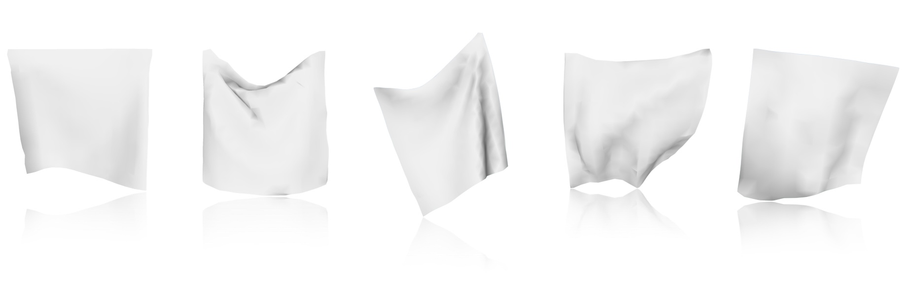
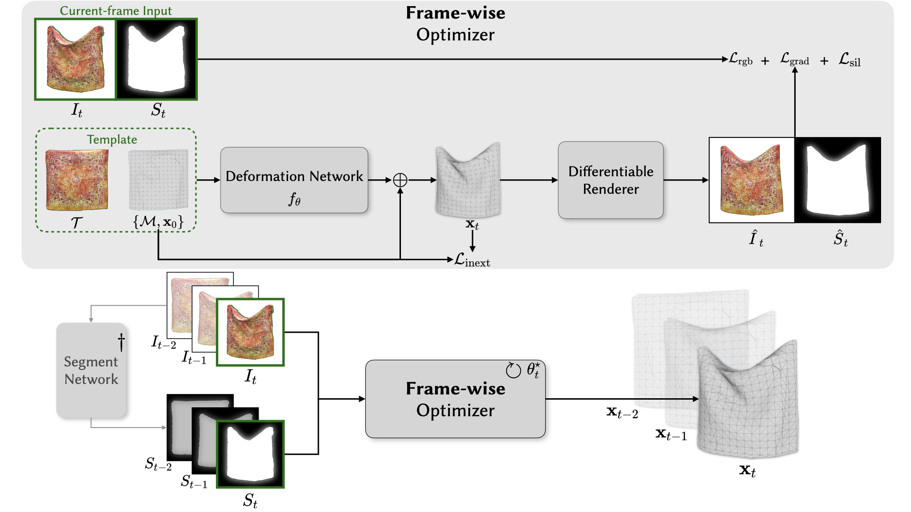

<p align="center">
  <h1 align="center">Image-Guided Shape-from-Template Using Mesh Inextensibility Constraints</h1>
  <h3 align="center"> Thuy Tran · Ruochen Chen · Shaifali Parashar <br> CNRS, École Centrale de Lyon </h3>
  <h3 align="center">ICCV 2025 </h3>
  <div align="center"></div>
</p>



# Abstract
Shape-from-Template problem aims to reconstruct 3D object given a template.
This repository provides a framework NSfT optimizing shapes using neural networks implemented in PyTorch.
The overall pipeline is shown in the figure below.



The object masks can be estimated using [SAM 2](https://github.com/facebookresearch/segment-anything).

# Installation
To install the dependencies, run the following command:

```pip install -r requirements.txt```
 
Our code still requires usage of differentiable renderers. 
We refer to the official documentation of the libraries [Nvdiffrast](https://github.com/NVlabs/nvdiffrast) and [PyTorch3D](https://github.com/facebookresearch/pytorch3d)
for installation instructions.

# Usage
To perform 3D reconstruction, you can config the runner using [ConfigMyPy](https://github.com/JeanKossaifi/configmypy).
Some config examples reported in our article can be found in [configs/ICCV2025](configs/ICCV2025).

Then, you can run the following command to start the runner:

```
python main.py --config_file=configs/your/config/file.yaml --output_path=path/to/save/results/
```

# Citation
# Acknowledgements
This work is supported by the project
RHINO (ANR-22-CE33-0014-01), a JCJC research grant. 

We also thank [Φ-SfT](https://github.com/navamikairanda/phi_sft) and [PGSfT](https://github.com/vc-bonn/Physics-guided-Shape-from-Template) for releasing their code and their valuable discussions about the benchmarks.